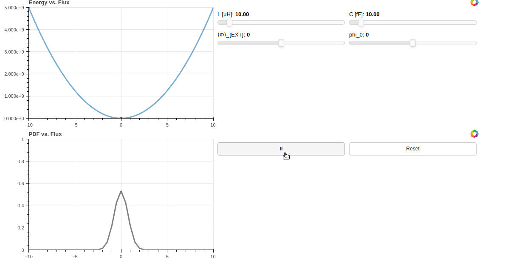

# Parmeterization: Getting simulation running on bokeh server

Mon 05 Jul 2021 06:03:21 PM EDT

Trying to debug parametrization.org

The other day at the meeting we found some problems with the
timescales involved.  Specifically the "mass" (capacitance) has to be
insanely small otherwise the simulation timescale becomes very short.

## Separate Directories

First thing I did was separate the directories again, so that now I
have "param.py" in a project directory.

I then had to add "main" to the path using the "sys" library, which
seems to have worked well.

It is worth plotting the Josephson inductance vs. the critical current to get a sense from about
10 nA to about 1 μA, as these are the scales used in Qubits, and correspond to fluxes on the 
order of Φₒ.

Looking at this, it seems that 1e-6 uA corresponds to about 3 nH.

if f = 1 GHz, then ω ≈ 6 Grad/s so T = 1 ns = 1 / √(L C).
⇒ L C = 1 / T² ⇒ C = 1/(T² L) = 1/(1e-18*1e-9)=1e-27.

Now Δx ~ √(ħ/2 * √(L/C)) ~ √(5e-35*√(1e-9/1e-27)) = √(5e-35*1e9) ~ 2e-13.

made a qubit circuit calculator in desmos

<https://www.desmos.com/calculator/ohpq1wiko6>

The end result was L = 1e-9, C = 1e-15, width is 3 e-16 and period is 6e-12

I feel like I should test it with known quantities, namely set C = ħ² and then
the timesteps shoudl be O(1)

## Tue 06 Jul 2021 09:11:46 AM EDT

OK, I had a few struggles, but it turned out the problem was fundamentally
that the plots weren't updating.  Evolve returns a solve_ivp object, but
I had been assuming it returned a wavevector (i.e. updated in place).

Indeed, that would be more useufl in the long run.

Once I fixed that, I was able to get everything to evolve in place and
look nice on the web page.  I now just need to change it back so
sliders work etc., as I had tod eisable all that during debugging
process.

The link above is to a gif, and should work if you go to the file to look at it.
## Aut-scaling of PDF

If you have an x range of X and a stdev of σ, assuming the distribution
is rectangular, the height should be 1/σ

I set it up to calculate the initial σ and then evolve from there.
I'm not sure I can reset x_range internally, but probably it is possible.

## Observing oscillation

I'm going to go back to wavevector to see if I can observe basic oscillations
in matplotlib

If we think about the schrodinger equation

ⅉ ħ ∂ψ/∂t = -ħ²/(2 m) ∂²ψ/∂x² + V(x)

if we divide by  ħ and set m = ħ, we can rewrite this as

ⅉ ∂ψ/∂t = -ħ/(2 m) ∂²ψ/∂x² + V(x)/ħ

thus if we want everything to be O(1), we need V(x) ~ ħ

I tested this and it works fine, as long as we set V = x**2 * ħ

But it doesn't seem to be working ok with the realistic L and C
values.

One quick way to rescale everything in the simulation to match matplotlib
test with wavevector.py is to set L_scale = 0.1, C_scale = 0.1*ħ, and Φₒ = 1.

ⅉ ∂ψ/∂t = -ħ/(2 ħ) ∂²ψ/∂x² + V(x)/ħ

let's take some other scales like σ ~ √(ħ*√(L/C)) ~ √√ħ thus ∂x² ~ √ħ and
∂t ~ 1

ⅉ ∂ψ = -1/(2 m) ∂²ψ/√ħ + V(x)/ħ

# Cleaning up Evolution
Wed 07 Jul 2021 07:15:46 PM EDT

I now have it evolving in place on the website, everything looking smooth and
everything.

I have experience in the past working with solve_ivp where it had real struggles in dealing with small numbers.

Let's try setting L_scale = 0.1*ħ, C_scale = 0.1*ħ.  In that case the
ground state will be width ~ √ħ which we don't want.  We want the width
to be O(1).  So √(L/C) ~ O(1/ħ) ⇒ L/C ~ O(1/ħ²).  But C ~ O(ħ) ⇒ L ~ O(1/ħ).

⇒ L_scale ~ 0.1/ħ

Wow that worked!  Very happy.  There is some unexplained breathing, not sure
what it's due to.  Need to experiment a bit with that.

# Reduce breathing of eigenstate

Try to see if I can reduce the extent to which I see breathing in the eigenstate.

First, just try increasing number of points. 

Didn't help.

I got a bit distracted and decided to add buttons to speed up and slow down the simulation.

# Fix classical evolution of eigenstate

Tue Jul 13 10:18:56 EDT 2021

The classical evolution of the eigenstate should follow the expectation
value of position.  I was trying to use operators etc. to calculate this, but
it wasn't working.  I decided to kludge it using list comprehensions.

